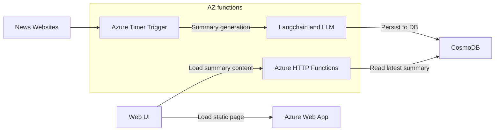

# newsgpt
cloud function implementation for newsgpt site: https://news-gpt.azurewebsites.net/


Architecture overview:


## Resources: 
- Medium post on azure openai langchai: https://medium.com/microsoftazure/azure-openai-and-langchain-eba69f18f050
- Azure OpenAI service: https://learn.microsoft.com/en-gb/azure/cognitive-services/openai/quickstart?tabs=command-line&pivots=programming-language-python
- Langchain summarized docs: https://python.langchain.com/en/latest/modules/chains/index_examples/summarize.html
- Azure function: https://learn.microsoft.com/en-us/azure/azure-functions/create-first-function-cli-python

## Run server locally
### Run azure function

install requirements
```bash
pip install -r requirements.txt
```

```bash
# terminal 1
azurite

# terminal 2
func start
```

Try APIs: http://localhost:7071/api/get_last_update

## Run webapp
Since azure function needs cold start, it normally has a high response time on first call. For API call, it is okay, but for front page, it is not ideal. Thus, we will host our front page in a free-tier Azure web app. The web app is a simple express web app which serve html template and do api call to our azure functions. 

To start locally
```bash
cd expressapp

npm start
```
Open UI: http://localhost:3000

## Deploy to cloud
### Deploy the azure function
After testing the functions locally, start the deployment to the cloud by following the steps in [this link](https://learn.microsoft.com/en-us/azure/azure-functions/create-first-function-cli-python?tabs=azure-cli%2Cbash&pivots=python-mode-decorators#create-supporting-azure-resources-for-your-function)

In our setup:
 - <RESOURCE_GROUP_NAME>: newsgpt
 - <APP_NAME>: newsgpt-ai


Lastly deploy the function to the cloud with the following command:

```bash
# Update app settings
az functionapp config appsettings set --name newsgpt-ai --resource-group newsgpt --settings AzureWebJobsFeatureFlags=EnableWorkerIndexing

# then deploy
func azure functionapp publish newsgpt-ai
```

### Deploy the webapp
- Create a new App Services using `Azure App Service` in VSCode. For our page, we created new App Services named news-gpt
- Choose `expressapp/` as the resource and deploy it to Azure 

The website is available at https://news-gpt.azurewebsites.net/

## Price Forecast

- Azure function: https://azure.microsoft.com/en-us/pricing/details/functions/
- Azure Cosmos DB: https://azure.microsoft.com/en-us/pricing/details/cosmos-db/
- Azure static web app: https://azure.microsoft.com/en-us/pricing/details/app-service/static/
- Azure OpenAI: https://azure.microsoft.com/en-us/pricing/details/cognitive-services/openai-service/

<!-- TODO -->

| Service | Price | Unit | Description |
| --- | --- | --- | --- |
| Azure Function | 0.0 | Execution | 1 million executions per month |
| Azure Cosmos DB | 0.0 | Execution | 1,000 request units per-second provisioned throughput with 25 GB storage	 |
| Azure web app | 0.00 | Execution | 60 mins CPU time daily |
| Azure OpenAI | 0.02 | 1000 | tokens, $0.3 every 2 hours |

## Notes:
 - Selenium is not supported in Azure functions, due to the use of webdriver chrome.
 - The prompt is with bullet point, however it is not shown as output. Will need more debugging.
